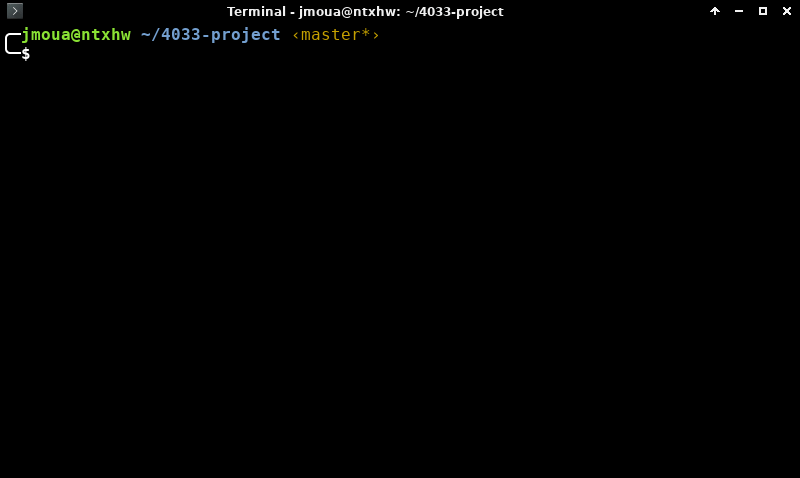
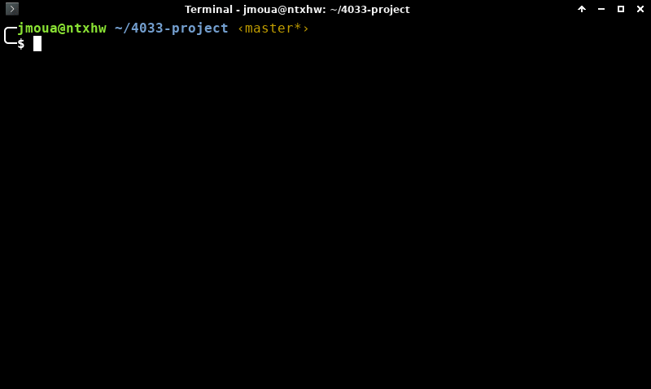
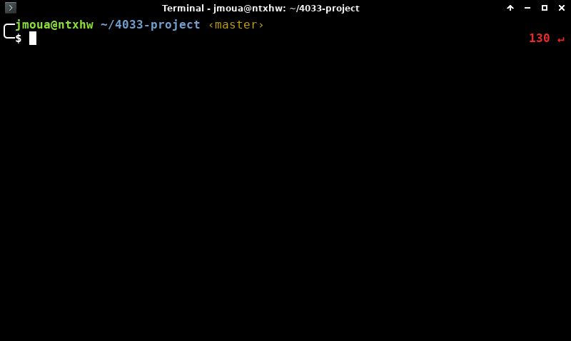
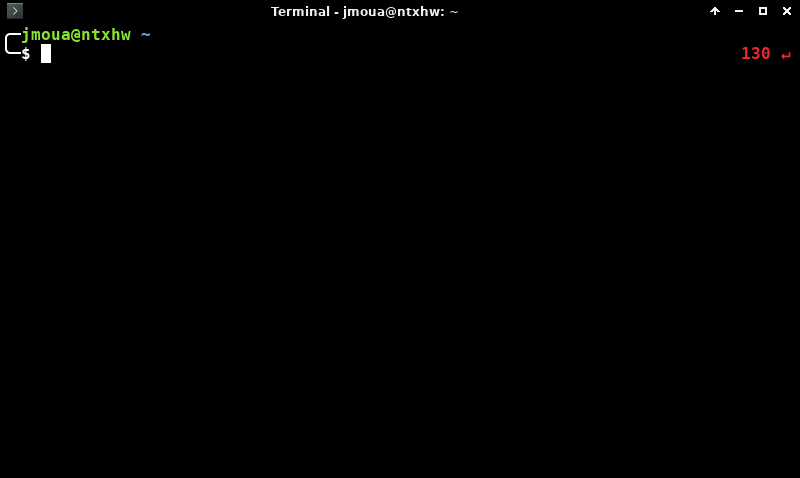
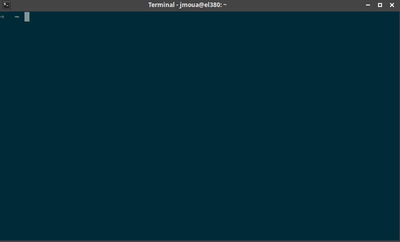

# Contents
+ [Tech Stack](#tech-stack)
+ [Source Control](#source-control)
+ [Deploying Final Product](#deploying-the-final-product)
+ [Getting Started](#a-start)
+ [Useful Tools](#useful-tools-to-use)
  + [Visual Studio Code](#visual-studio-code)
  + [Postman](#postman)
  + [Learning Javascript](#learning-javascript)
+ [Connecting to the Database](#connecting-to-the-mysql-database)

# Tech Stack
The tech stack that we'll be using:
+ **Node.js** - for back-end stuff like handling data.
+ **EJS** - HTML templating engine for rendering front-end.
+ **MySQL** - our database to host our server.
+ **Express.js** - to handle HTTP requests.

## Node.js
You can install `Node.js` <a href="https://nodejs.org/">here</a>, or if you're using a variant of Linux, you can use your package manager to install it. Windows also has a package manager, but it's a third party package manager called `Chocolatey` which can be found <a href="https://chocolatey.org/">here</a> (I recommend using `Chocolatey` since it's really good for downloading software on Windows). **Get _both_ `Node.js` and `MySQL` installed on the machine in which you'll be working on. Without either of those two, you will not be able to do any useful testing**.

## EJS
This is going to be a templating engine that we use to render things. HTML isn't Turing-complete, but if we combine it with some form JavaScript, we can get it to do stuff we actually want.

There are also front-end frameworks and libraries such as `React.js` and `Angular.js`, but those have steep learning curves and I don't think there is enough time to learn them.

## MySQL
This is the SQL database we'll be using. The connection details are pinned on the Discord message. The server should be up most of the times, since it is being hosted on Amazon's Web Services.

## Express.js
While `Node.js` can handle HTTP requests, we will have to manually write them and be verbose with a lot of stuff. To make things easier, `Express.js` is a framework that we can install using the Node Package Manager `npm` which will handle all the nitty gritty details for us.

# Source Control
We will be doing source control management via `Git`. `Git` has somewhat of a learning curve, but is an extremely powerful tool for organizing a codebase. There are a lot of tutorials on how to use `Git`. I would suggest watching a brief tutorial on `Git` before we start coding, and experimenting with it.

There are many groups that will host `Git` repositories. One host that we'll use is called [GitHub](https://www.github.com), so be sure to create an account there.

# Deploying the final product
I want us to be able to deploy our final product onto `Heroku`. Heroku is just a platform we can use to host our web application for **free**. We can then put this on our resume or portfolios with a link to it. I already have a dummy project sitting <a href="https://trustworthy-tutors.herokuapp.com">here<a/> as an example.

# First Steps
I (Jim) said that I would create the skeletal folder for our project. I am going to post GIF images here on the exact steps I've done so you may follow for future references.

I will assume you have `Git` and `Node.js` installed. If you do, they should work in the command line (Windows included).

## Initializing the repository
Here, we are creating the project folder and initializing a `Git` project. Only do this when you are creating a new project.
 


## Initializing a `Node.js` project.
We initialize the Node project with the `npm` command.
```
$ npm init -y
```
 

 
The `y` flag is a basically a *yes to all* kind of thing (accepts default settings).

## Installing our required Node packages
```
$ npm i express express-session ejs mysql bcrypt redis connect-redis -S
```
 

 
The `i` is shortened for `install`, and the `S` flag means to save these package names to the `package.json` file that was generated when we did an `npm init -y`. Our install packages are in a folder called `node_modules`.

The `mysql` package is a package that will be used for getting stuff to and from the database.

`bcrypt` is a package that will hash passwords. We will be storing hashes into the DB instead of plain text.

`redis` is a session store which we will store user sessions.
> The default server-side session storage, `MemoryStore`, is purposely not designed for a production environment. It will leak memory under most conditions, does not scale past a single process, and is meant for debugging and developing.

# Getting Started
I have created a file called `server.js`. When we want to run our server for testing purposes, we can type in `$ node server.js`, but the preferred way is to run it with `nodemon` so we don't have to manually restart the server every time we make a change.
 

 
**Here is the code in the `server.js` file**
```javascript
// Requires
const express = require('express');
const expressSession = require('express-session');

// Create server called app
const app = express();

// Middlewares
app.use(express.json());
app.use(express.urlencoded({ extended: false }));

// Set templating engine to EJS
app.set('view engine', 'ejs');

// Define our port
const port = process.env.PORT || 5000;

// render index.ejs using EJS when someone goes to home address
app.get('/', (req, res) => {
  res.render('index.ejs');
});

// Listen on port
app.listen(port, () => console.log(`Listening on port ${port}.`));
```

**views/index.ejs**
```html
<!DOCTYPE html>
<html lang="en">
<head>
    <meta charset="UTF-8">
    <meta name="viewport" content="width=device-width, initial-scale=1.0">
    <meta http-equiv="X-UA-Compatible" content="ie=edge">
    <title>Trustworthy Tutors</title>
</head>
<body>
    <div>
        <div>
            <h1>Trustworthy Tutors</h1>
        </div>
        <div>
            <p>It's a start!</p>
        </div>
    </div>
</body>
</html>
```

### Running the server
To run the server, we can simply issue this command.
```
$ node server.js
```
Our server is being hosted on port `5000`, we can go over to our preferred web browsers and type into the URL bar `http://localhost:5000`.


# More `Git` and how to get these files
I will be creating the remote repository in which we will all be working to and from. Before doing that, there are some things I should cover.

We should never include the `node_modules` file in our `Git` repository. That folder can be a large folder, so we put it inside a file called `.gitignore` (yes, that's a period in front of it). I will be appending `node_modules` folder into the `.gitignore` file via the `echo` command and a shell directional operator. You can also manually open up the `.gitignore` file and add the name of the folder to it.
```
$ echo node_modules >> .gitignore
```

I'll then `add` the rest of files so `Git` can track them while we work on the project. Then I'll `commit` to finalize the changes. Additionally, we can see a log of who commited by typing in `$ git log`.



Finally, I'll create the Github repository and connect this repository to it. The way I am doing a push and pull from the repository will be via SSH, so I will be adding an SSH remote repository.



You can see the remote repository by click <a href="https://www.github.com/jimmoua/4033-thanos-tech">here<a/>.

## Getting started
Please generate an SSH key and add it to your Github account by following these steps. You can read on how to do that <a href="https://help.github.com/en/enterprise/2.15/user/articles/generating-a-new-ssh-key-and-adding-it-to-the-ssh-agent">here</a>. Just be sure to select your operating system so you can follow the correct guide.

**If you live on campus, I will have to add an HTTP remote. ATU Resnet does not allow SSH requests into any other server besides Boole without using a VPN**.

### Cloning the repository
To get the repository, you do a `clone` command. You should only do this once - when you're on a machine that doesn't have the project files.
```
$ git clone git@github.com:jimmoua/4033-thanos-tech.git
```

### Installing required node modules
If you're not in the `4033-thanos-tech` folder, go into that folder via a `cd` command. Remember that we don't include the `node_modules` folder. This is because we can have a lot of modules which will increase the size of our project. Because of this, we don't want to push all the modules into the remote repository, but rather download them onto our machines instead. We do that like this:
```
$ npm i
```
This reads the packages from the `package.json` file, sees which dependencies our `Node` project requires, and then downloads them.



# Useful tools to use
Below are some very useful tools that I recommend.

## Visual Studio Code
I suggest using a good editor unless you like using the CLI and sticky to Vim or Emacs (either are highly customizable but a pain). I highly recommend **Visual Studio _Code_** (not normal Visual studio). You can install many extensions into VsCode like IntelliSense for almost any language.

If you get VsCode, I suggest installing some basic web development extensions. There is a vim extension as well and tools that will let you write SQL commands.

You can get it [here](https://code.visualstudio.com) or from your package manager.

## Postman
In the final product, we'll be sending data to and from the database via user events. But obviously, in the beginning, front-end isn't developed yet, so if you're wanting to do back-end development, `Postman` is going to be your friend. It will allow you to submit various HTTP requests without there having to be an existing front-end interface.

Get it [here](https://www.postman.com/) or get it from your package manager.

## Learning JavaScript
Most of the stuff we're doing is JavaScript. Please see JavaScript [here](https://developer.mozilla.org/en-US/docs/Web/). If your foundation in C/C++ is good, picking up JavaScript will be very easy IMO. You don't have to get into all built in data structures that JavaScript has to offer. I'd say an equivalence of COMS 2203 (programming II) is enough - though there are some very useful standard functions you ought to know in JavaScript.

## For the front-end peeps
`HTML` is how a website should be displayed. Without CSS, the website looks very simple. `CSS` allows us to give style to how that website should look like and can provide animations/colors/pretty stuff.

If you're doing front-end please check out the links below.
### HTML5
Learn some HTML [here](https://developer.mozilla.org/en-US/docs/Web/html).

### CSS
Learn some CSS [here](https://developer.mozilla.org/en-US/docs/Web/css).

# Connecting To The MySql Database
**THOSE ARE WHO DOING DATABASE, PLEASE SAVE ALL YOUR DATABASE SCHEMATICS AND FILES.**

**The password is on Discord**. You can use CLI MySql to connect. If you're on Windows, I'm not sure how it's configured, but for *nix users, if you have either `MySql` or `MariaDB` installed, you can can use command:

```
$ mysql -h thanos.cxcs9abwkocb.us-east-2.rds.amazonaws.com -u admin -p
```



You have use MySql Workbench too, if you have it. I think it comes with MySql installation on Windows. If you decide to use the MySql Workbench, the connection information is on Discord for that. Setup for it should be pretty intuitive.